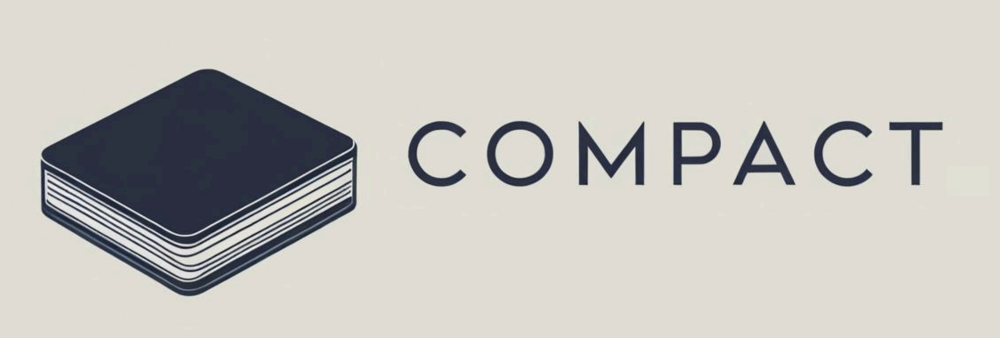

<p align="center">
  
</p>

<p align="center">
  <a href="https://princetonvisualai.github.io/compact/">
    
  </a>
</p>
</p>
<hr>

# COMPACT

**COMPACT: COMPositional Atomic-to-Complex Visual Capability Tuning**

🚧 Under Construction 🚧

[[paper](https://arxiv.org/abs/2504.21850)][[website](https://princetonvisualai.github.io/compact/)]


Authors: [Xindi Wu](https://xindiwu.github.io/)\*, [Hee Seung Hwang](https://www.linkedin.com/in/willhshwang/)\*, [Polina Kirichenko](https://polkirichenko.github.io/), [Olga Russakovsky](https://www.cs.princeton.edu/~olgarus/)

(* Denotes equal contribution)

We propose COMPACT, a data recipe that scales capabilities of Multimodal Large Language Models (MLLMs) from atomic (k = 1) to complex (k > 1) compositional levels. By creating a training dataset with a balanced distribution of compositional complexity, COMPACT enables models to learn complex capabilities more efficiently.

## News 🔥
- [04/30] We have released the COMPACT data recipe for visual compositional tuning.

## Table of Contents
- [Installation](#installation)
- [Dataset](#dataset)
- [Training](#training)
- [Evaluation](#evaluation)
- [Results](#results)
- [Citation](#citation)

## Installation

First, clone the repository and navigate to the project directory:

```bash
git clone https://github.com/princetonvisualai/compact.git
cd compact
```

To set up the environment for COMPACT training (following LLaVA (https://github.com/haotian-liu/LLaVA)):

```bash
conda create -n compact python=3.10 -y
conda activate compact
pip install --upgrade pip
pip install -e .
pip install -e ".[train]"
pip install flash-attn --no-build-isolation
```

## Dataset

COMPACT provides a balanced distribution of training examples across different compositional complexity levels (k = 1, 2, 3). The datasets include:

1. **Compositional Tuning Data** - Questions generated to require exactly k specific atomic capabilities
2. **Instruction Tuning Data** - A random subset of LLaVA-665K for maintaining instruction following capabilities

### Dataset Structure

COMPACT divides visual capabilities into 10 atomic categories:

- **Attribution**: color, shape
- **Recognition**: object recognition, action recognition, text recognition, spatial recognition, counting
- **Relation**: spatial relationship, object interaction, scene understanding

Each question in our dataset explicitly requires the integration of k specific atomic capabilities.

### Dataset Generation

You can generate your own compositional training data by running:

```bash
python compact/main.py \
  --image_dir path/to/images \
  --output_dir path/to/output \
  --k 3 \
  --num_samples 1000 \
  --api_key YOUR_GEMINI_API_KEY \
  --processes 32

```


## Training 
(🚧 Under Construction 🚧)

Train a model with the COMPACT dataset:

```bash
sh train_scripts/train_compact.sh
```


## Evaluation 
(🚧 Under Construction 🚧)

Evaluate your COMPACT-trained model on various benchmarks:

```bash
python evaluation/evaluate_model.py \
  --model_path path/to/model \
  --benchmark mmvet,mmstar,seedbench2plus,infovqa,textvqa,mme,cvbench,llava-wild
```

## Results

With only 10% of the data used in LLaVA-665K, COMPACT achieves comparable performance across standard benchmarks:

| Model | Data Size | InfoVQA | SeedBench2+ | MME | TextVQA | MM-Vet | CV-Bench | MMStar | LLaVA-W | Rel. (%) |
|-------|-----------|---------|--------------|------|----------|---------|-----------|--------|----------|-----------|
| LLaVA-665K | 665K | 20.80 | 41.72 | **1478.48** | **46.99** | 29.22 | **60.92** | 35.11 | **68.50** | 100.00 |
| COMPACT (ours) | 65K | **23.68** | **43.13** | 1379.94 | 44.37 | **31.74** | 55.28 | **36.13** | 64.50 | **100.18** |

<!-- COMPACT shows substantial improvements on complex queries (k ≥ 3):

- 83.3% improvement on MMStar for k=4 tasks
- 94.0% improvement on MM-Vet for k=4 tasks   -->

## Citation

If you find this repository useful for your research, please cite our paper:

```
@article{wu2025compact,
  title={COMPACT: COMPositional Atomic-to-Complex Visual Capability Tuning},
  author={Wu, Xindi and Hwang, Hee Seung and Kirichenko, Polina and Russakovsky, Olga},
  journal={arXiv preprint arXiv:2504.21850},
  year={2025}
}
```
